# Gym Diary

Work in progress mobile app for tracking workouts, reviewing history, and visualising progress over time.

<p align="center">
  
</p>

## Screenshots

These screenshots show the 0.26.1 demo on iPhone and iPad.

### iPhone

#### History and Programs

<p align="center">
  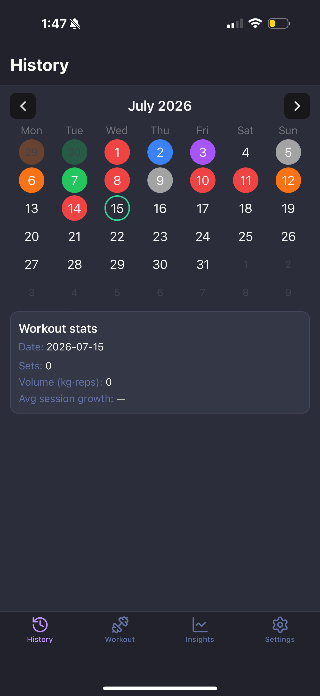
  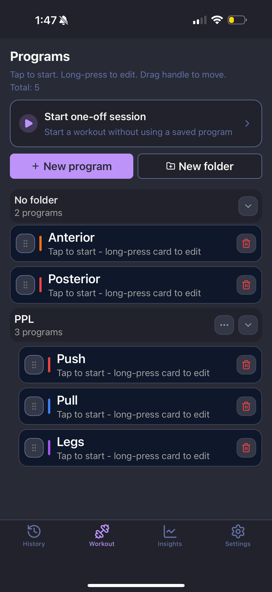
  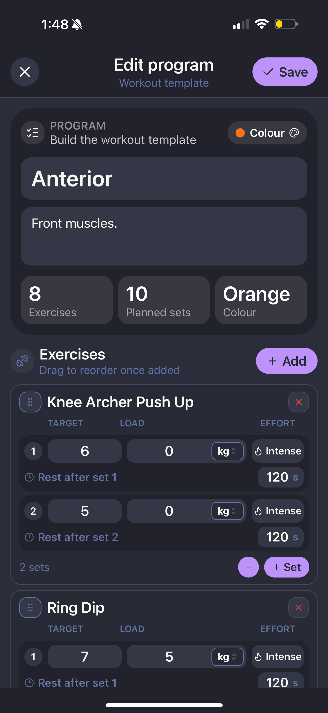
</p>

#### Session Tracking

<p align="center">
  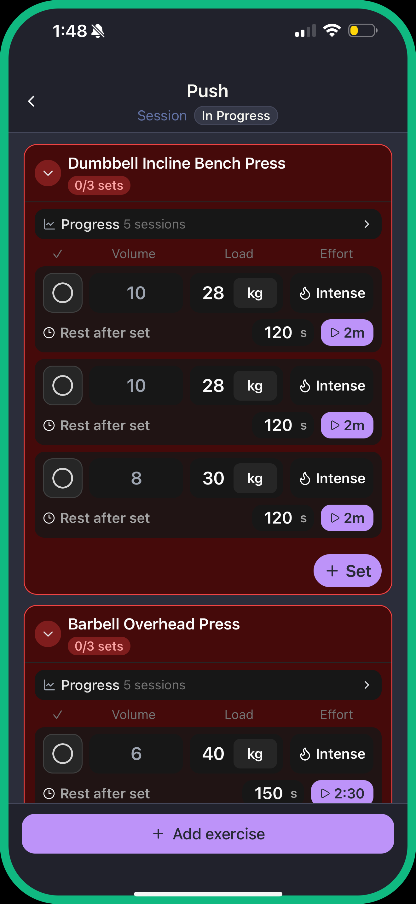
  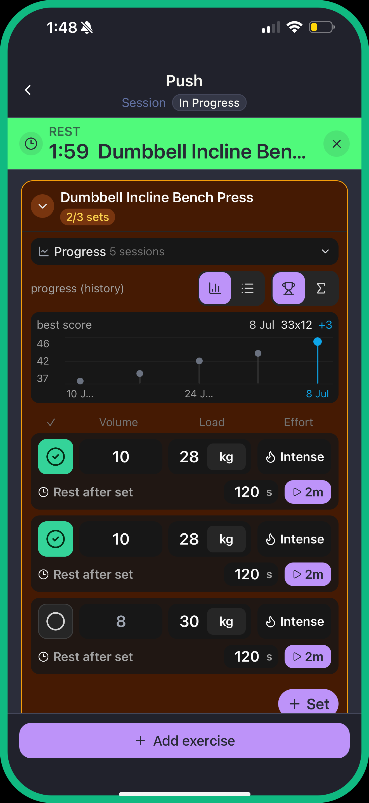
</p>

#### Insights

<p align="center">
  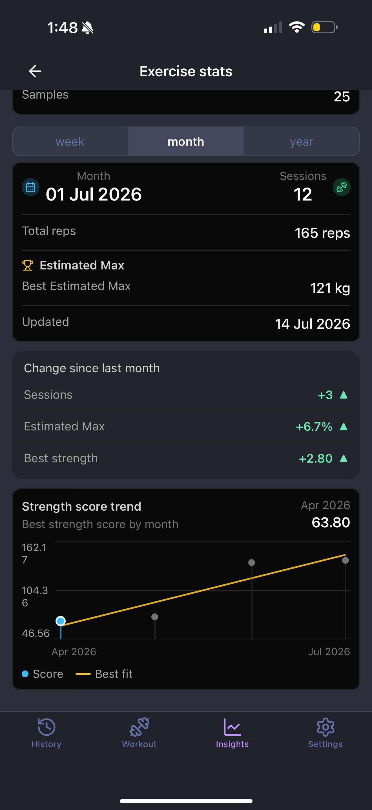
  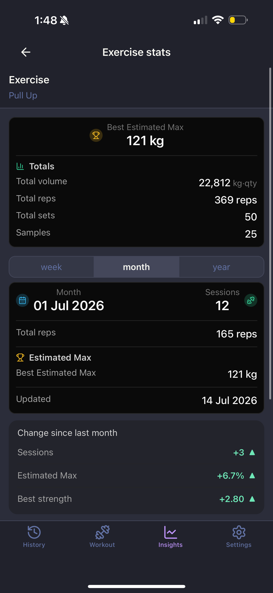
  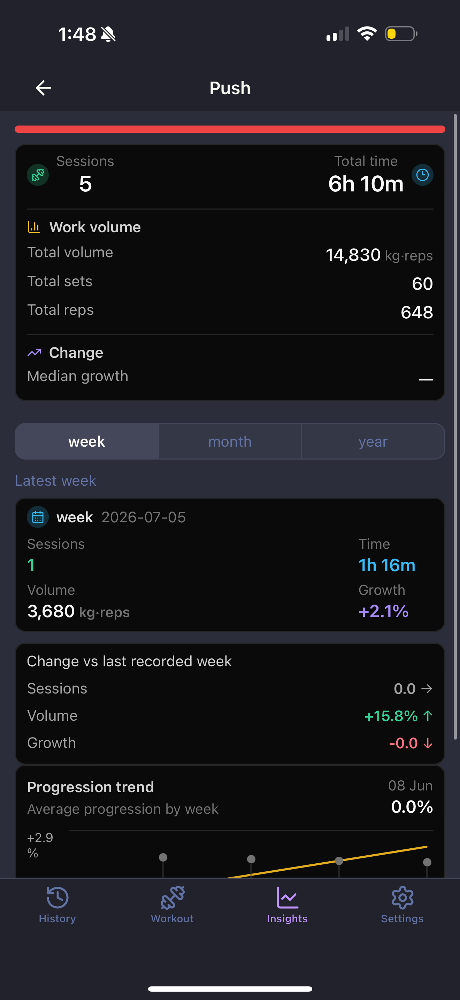
  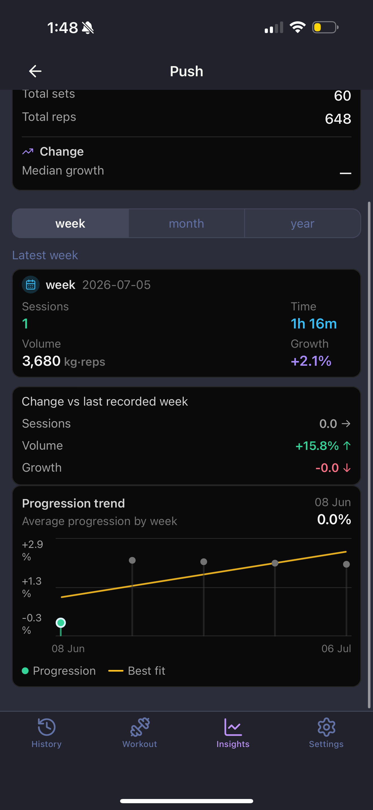
</p>

### iPad

#### History and Program Editing

<p align="center">
  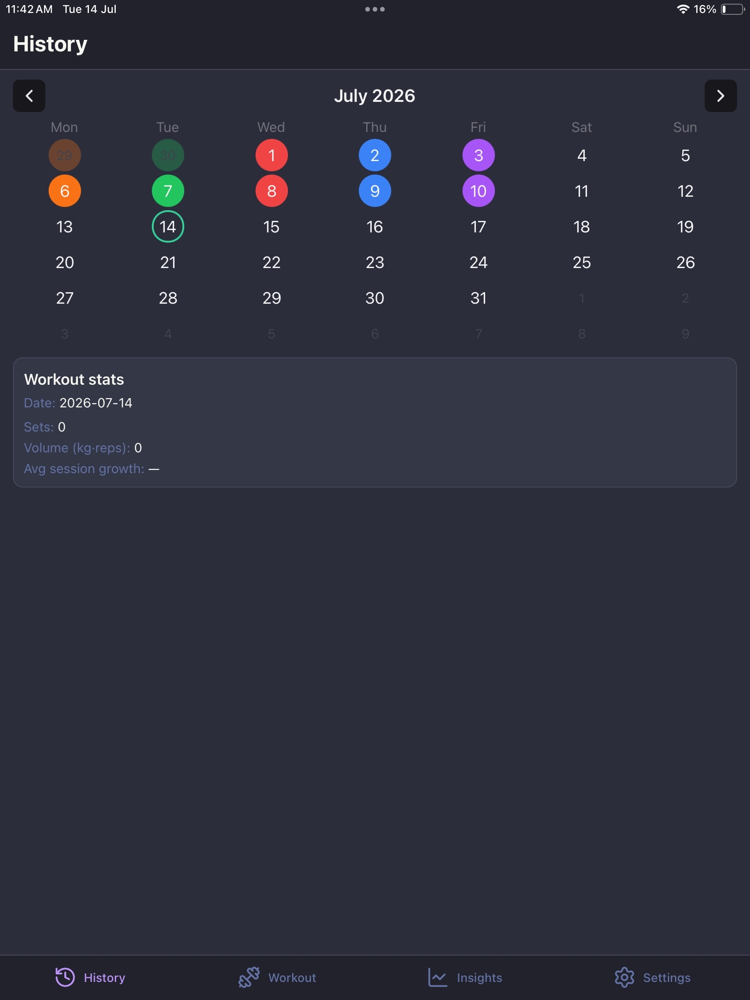
  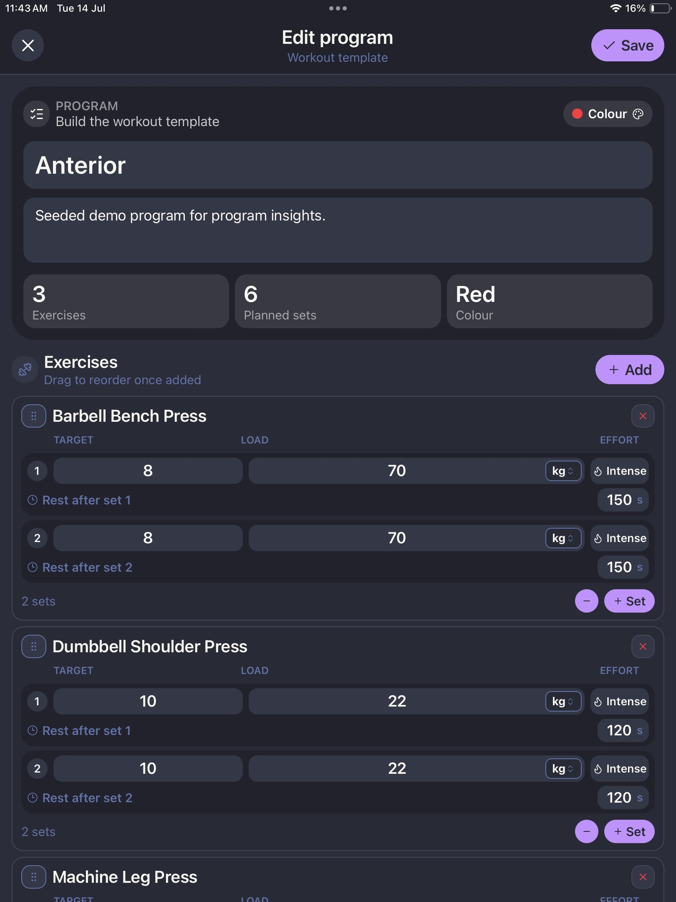
</p>

#### Session Tracking

<p align="center">
  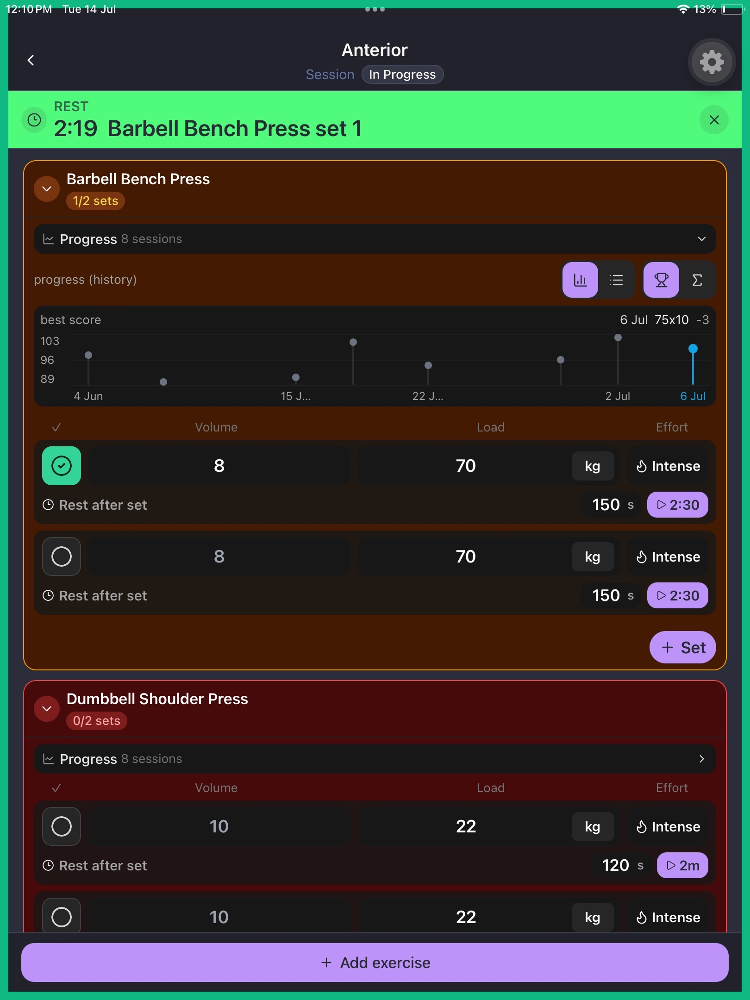
  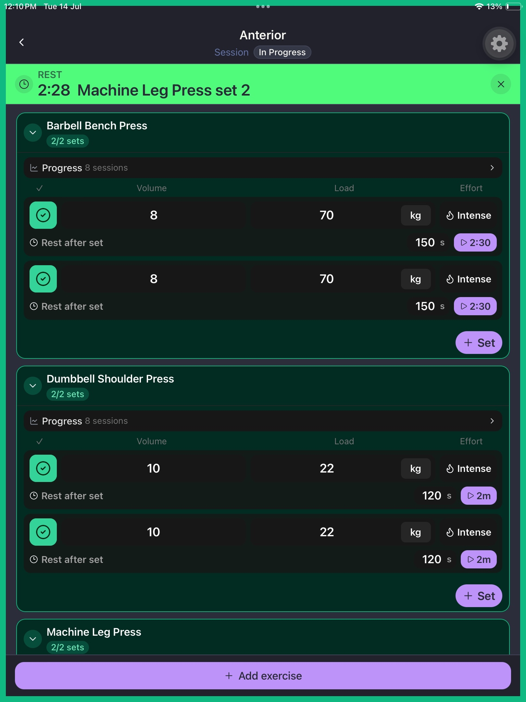
</p>

#### Insights

<p align="center">
  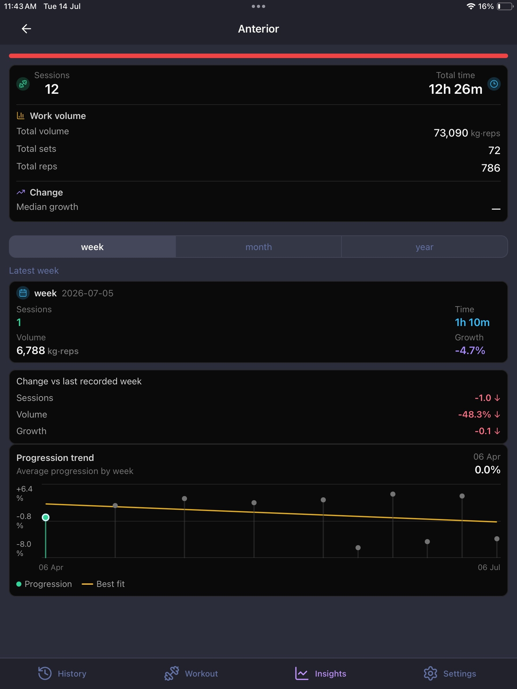
  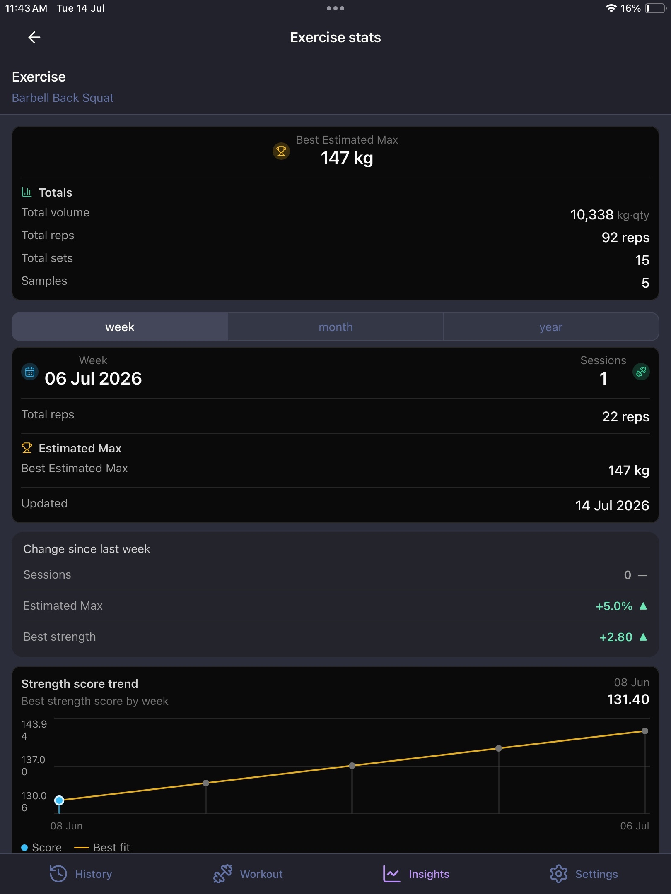
</p>

## Repo Layout

```text
repo/
  apps/
    api/          # NestJS backend
    mobile/       # React Native / Expo mobile app
  packages/
    exercise/       # Shared exercise library and types
    strength-score/ # Shared score strategies and aggregators
  docs/
    0.26.1/       # Current iPhone and iPad demo screenshots
```

## Prerequisites

- Node.js 22.13.0. The repo includes `.nvmrc`; run `nvm use` from the repo root if you use nvm.
- npm. Use npm for this repo so the checked-in lockfiles stay consistent.
- For mobile development: Expo tooling through `npx expo`, plus Expo Go, a development build, an Android emulator, or an iOS simulator.
- For iOS native builds: macOS with Xcode.

## Install

From the repo root:

```bash
nvm use
npm install
npm --prefix apps/mobile install
npm --prefix apps/api install
```

## Run

API:

```bash
npm run dev:api
```

Mobile:

```bash
npm run dev:mobile
```

Use the Expo CLI output to open the app on iOS simulator, Android emulator, Expo Go, or a development build.

## Local API Access From Mobile Devices

A phone cannot reach `http://localhost:<port>` on your computer.

Use one of these:

- Android emulator: `http://10.0.2.2:<port>`
- iOS simulator: `http://localhost:<port>`
- Physical phone on Wi-Fi: `http://<your-computer-LAN-IP>:<port>` with the backend bound to `0.0.0.0`
- Android physical device over USB: `adb reverse tcp:<port> tcp:<port>`

Keep base URLs in app config, for example `apps/mobile/src/shared/config/env.ts`.

## Shared Packages

- `@gym-diary/exercise` provides shared exercise definitions and types.
- `@gym-diary/strength-score` provides score strategies and aggregators used by insights.

## Environment Variables

Create `.env` files per app as needed:

- `apps/api/.env`
- `apps/mobile/.env`

Always commit `.env.example` files, never real secrets.
